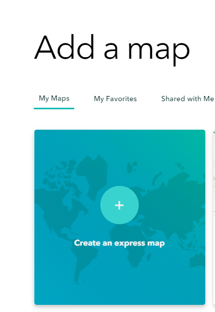

# StoryMaps
tutorial

https://github.com/zarazaga/StoryMaps
Jessie Zarazaga – SMU Iniative for Spatial Literacy – jzarazaga@smu.edu

## Overview

This workshop aims to introduce participants to basic tools, concepts and techniques for creating web-stories which integrate text, images and maps, using StoryMaps, an online software distributed by Esri.   

GIS@SMU website - https://www.smu.edu/libraries/fondren/services/gis

# StoryMaps

tutorial link - https://github.com/zarazaga/StoryMaps

Jessie Zarazaga – SMU Iniative for Spatial Literacy -     jzarazaga@smu.edu

GIS@SMU website - https://www.smu.edu/libraries/fondren/services/gis

## Setup

prepare for this workshop by signing up for an ArcGIS online account.

SMU Affiliates with a valid SMU_ID can login to the Enterprise account at: [ArcGIS Online](https://www.arcgis.com/home/index.html) 

Use the ENTERPRISE login for 'smudallas' to set up an account with your SMU password [smudallas](https://www.arcgis.com/sharing/rest/oauth2/authorize?client_id=arcgisonline&display=default&response_type=token&state=%7B%22useLandingPage%22%3Atrue%7D&expiration=20160&locale=en-us&redirect_uri=https%3A%2F%2Fwww.arcgis.com%2Fhome%2Faccountswitcher-callback.html&force_login=true&hideCancel=true&showSignupOption=true&canHandleCrossOrgSignIn=true&signuptype=esri)

Or signup with a [free ESRI developer account](https://developers.arcgis.com/sign-up/)

### Data

The data package for the workshop can be downloaded from [https://github.com/zarazaga/storymap/data](https://github.com/zarazaga/StoryMaps/tree/master/TTU_data)

The data folder contains the following data:

* information.txt  - an optional text file for you to use to make this storymap
* college-view.jpg  - an image of the campus

#### Additional Files
There is an extra backup data folder that contains versions of files that we will create during the workshop.
 
## Getting started
open a [new storymap](https://storymaps.arcgis.com/) and sign on, then '+' a story . . 

First Write a title (*Taita Taveta University* ) and sub-title ( *home of ideas* )

and add the image 'college view' 

From the '+' select the element on the dropdown menu to include:

first add a Paragraph . . 

note: open the [text file](https://github.com/zarazaga/StoryMaps/TTU_data/information.txt) if you want to use the text I have prepared . .

then add a quote:

Add a heading:  'Vision'
and an image: students_o
and some text explaining the university vision

And another heading: location
and add a 'map' ; 
start with an express map-

and create a location map for the univeristy.

Add a few layers . . 

