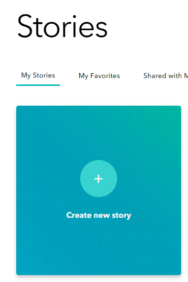
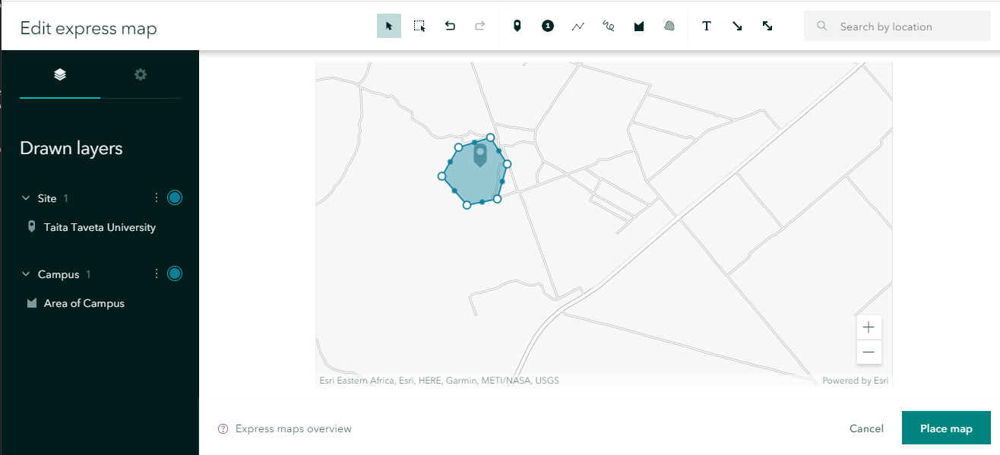

# StoryMaps

tutorial link - https://github.com/zarazaga/StoryMaps-Tutorial-Kenya

Jessie Zarazaga – SMU Iniative for Spatial Literacy – jzarazaga@smu.edu

GIS@SMU website - https://www.smu.edu/libraries/fondren/services/gis

## Overview

This workshop aims to introduce participants to basic tools, concepts and techniques for creating web-stories which integrate text, images and maps, using StoryMaps, an online software distributed by Esri.   The exsample is focused on creating a new page for Taita Taveta University in Kenya.

## Setup

prepare for this workshop by signing up for an ArcGIS online account.

SMU Affiliates with a valid SMU_ID can login to the Enterprise account at: [ArcGIS Online](https://www.arcgis.com/home/index.html) 

Use the ENTERPRISE login for 'smudallas' to set up an account with your SMU password [smudallas](https://www.arcgis.com/sharing/rest/oauth2/authorize?client_id=arcgisonline&display=default&response_type=token&state=%7B%22useLandingPage%22%3Atrue%7D&expiration=20160&locale=en-us&redirect_uri=https%3A%2F%2Fwww.arcgis.com%2Fhome%2Faccountswitcher-callback.html&force_login=true&hideCancel=true&showSignupOption=true&canHandleCrossOrgSignIn=true&signuptype=esri)

Or signup with a [free ESRI developer account](https://developers.arcgis.com/sign-up/)

### Data

The data package for the workshop can be downloaded from [TTUdata](https://github.com/zarazaga/StoryMaps/tree/master/TTUdata.zip)

The data folder contains the following data:

* information.txt  - an optional text file for you to use to make this storymap
* college-view.jpg  - an image of the campus

#### Additional Help
The Storymap that will be built in this tutorial will be similar to this one: https://storymaps.arcgis.com/stories/a1d1dc5d48334c1f9aa9e412e23470ea

Open it as a model to work with . .
 
## Getting started
open a [new storymap](https://storymaps.arcgis.com/) and sign on, then '+' a story . . 

First Write a title (*Taita Taveta University* ) and sub-title ( *home of ideas* )

and add the image 'college view' 

From the '+' select the element on the dropdown menu to include:

first add a Paragraph . . 

note: open the [text file](https://github.com/zarazaga/StoryMaps/TTU_data/information.txt) if you want to use the text I have prepared . .

and under the 'text' button add text . .

then add a quote:

Add a heading:  'Vision'
and an image: students_o
and some text explaining the university vision

And another heading: location
and add a 'map' ; 
start with an express map-

and create a location map for the univeristy.

Add a few layers . . 

Once the map is placed, it can still be edited. 
Under 'settings' (the small gear) change the basemap
and add a 'legend'

here is a link to my version - to follow along 
https://storymaps.arcgis.com/stories/a1d1dc5d48334c1f9aa9e412e23470ea

Next, add a Sidecar . . 

Add a sub-heading: Strategic Pillar
and add a series of images of the univeristy:.  

Eventually there should be a sub-heading for each pillar that the university wishes to describe, but these can be re-arranged later. 

Pillar 1: Research,  Pillar 2: Facilities, Pillar 3: Student experience Pillar 4: Human Resources,  Pillar 5: Financing and Resources, Pillar 6: Leadership

Put an image with each Pillar; for each image- add some text . .
Pillar 1: research, you can add a web-link and another link in Pillar 2.
There is a video to add to Pillar 3: 
https://arcg.is/0SWnrT

Carry on and add pages for Pilars 4 and 5. 

Now return- below the black line= to the small blue '+' select "text" again, and add a heading (Tt bold and large) some text, and the quote ("). 

Add another side car- only this time, put the text on the left, and a map with local data on the right. 

Instead of adding an express map, make use of ARcGIS online to gather data layers about the regions of Taita Taveta, and show them on a map. 

In a new browser window open ArcGIS online, and make a new map.

Zoom to KENYA, and add the following data sets to your map

(or add any other data you find more interesting)

Save this map with a NAME you can remember . .
LEAVE ArcGIS Online.

Now return to StoryMap and use the banner to Add a sidecar. Selecting a 'docked panel' add the text on the left - describing vegetation, and add a map on the right to illustrate that. 

Find your own ArcGIS map  . .and add it.

Make sure only one of the Map layers is visible, and zoom to the scale at which you want this map-data to show. Then click 'place map'.

Staying in the same sidecar, add another map.(Add Media/ Add Map). Select the same map again, but choose different layers to add. Zoom in slightly to show, for example, the Kenya Wetlands around Taita Tavet and Voi.

Finally add the same map a third time but this time zoom in further, and show the detailed information around the Taita Hills, collectd by research teams working with the University. 

Figure out how to add some additional images into the running text box, and how to add a 'button' with a link to the University Website. 

Finally finish with an ending text and a photo of the gateway.

ESRI updates STORYMAP buttons and options with great frequency.  The specific instructions in this tutorial are probably already out of date- but the general idea should still work. As with all GIS - part of the skill is learning to know what you want, and to figure out the paths to get there.

